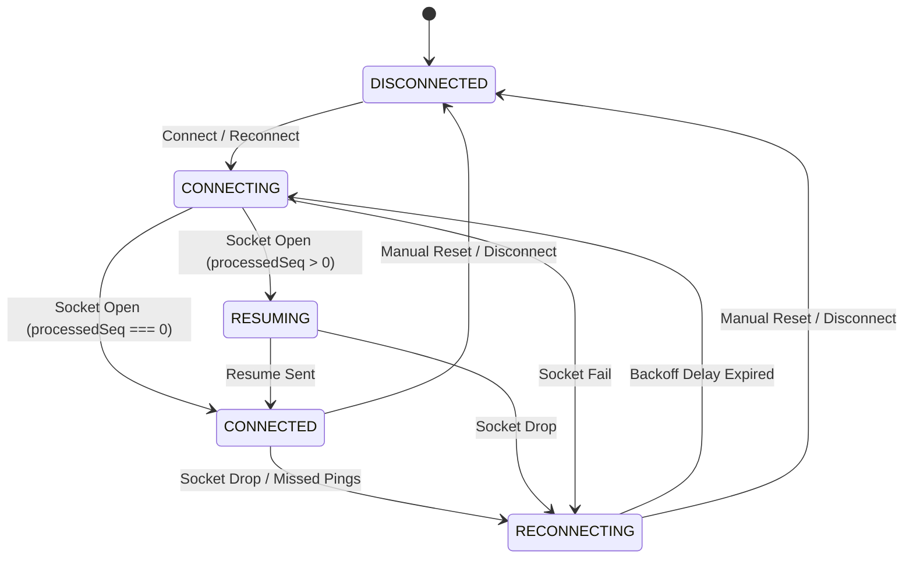
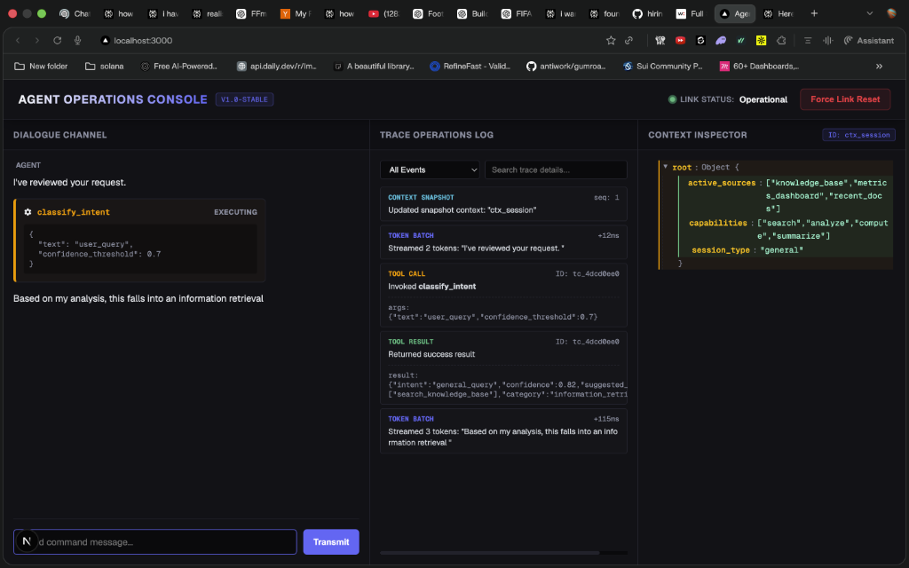
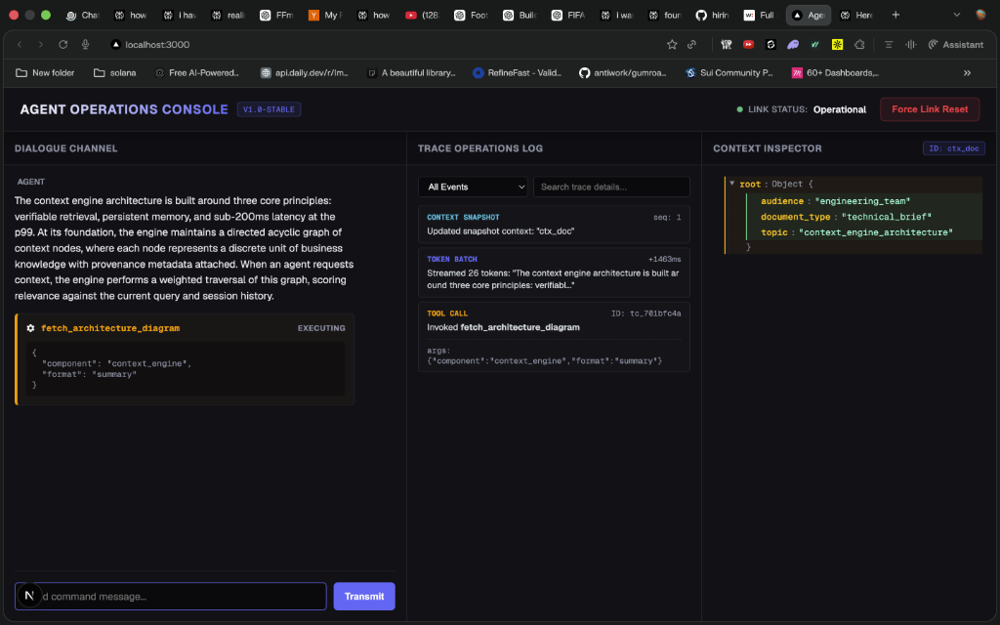
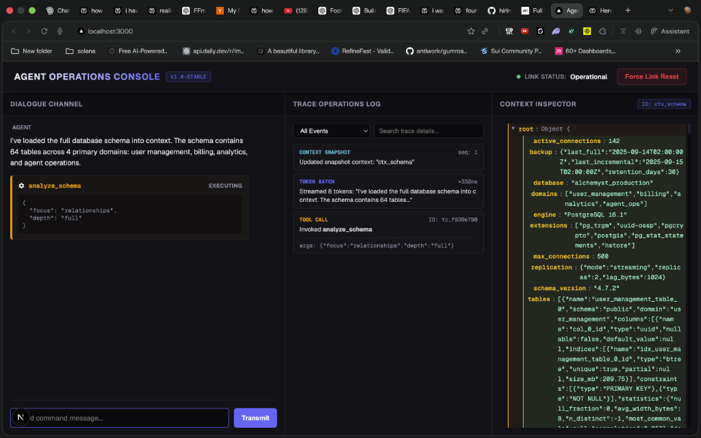

# Real-time Agent Operations Console

A resilient Next.js 14+ App Router dashboard built in strict TypeScript to coordinate, render, and trace streaming interactions with a context-aware AI agent WebSocket backend. Designed to survive latency spikes, connection drops, reordered frames, duplicate sequence numbers, and oversized payloads.

## Architectural Approach

The application decouples network transport from visual representation using an **Event Sourcing Model**. The WebSocket Controller acts as the single source of truth, managing a sliding-window sequence buffer, immediate out-of-band heartbeats, and a dedicated Tool Call Registry to suppress duplicate ACKs. React views act as read-only snapshot projections of the contiguous event log, utilizing CSS layout containment to eliminate reflow jumps and lazy trees to prevent UI freezes.

---

## WebSocket Connection State Machine



---

## Key Engineering Decisions

* **Runtime Protocol Validation**: Strictly narrows incoming JSON payloads at the network boundary (`isServerMessage()`) rather than relying on compile-time assertions.
* **Sliding Window Sequence Buffer**: Buffers out-of-order sequence streams, filters duplicate events, and flushes sequentially to ensure correct chronological delivery.
* **Self-Healing Reconnection**: Enforces a 200-frame buffer cap and a 2-second gap timeout to detect permanent network drops and recover state via `RESUME` payloads.
* **ACK Suppression via Settlement Delay**: Employs a 50ms delayed scheduler for `TOOL_ACK` dispatching, suppressing redundant ACKs if the replayed `TOOL_RESULT` has already arrived.
* **Event Sourcing & Projections**: Decouples socket states from UI views. React views act as read-only snapshot projections of the contiguous event log.

---

## Verification & Status Summary

* **Automated Tests**: 25 Vitest unit and integration tests passing successfully (covering sequence reordering, heartbeats, tool ACK suppression, reconnect resume, malformed payload rejections, buffer caps, gap timeouts, error recovery, and complex reconnect-replay sequences).
* **TypeScript Strict Mode**: Fully enabled and verified with zero compiler errors.
* **Production Build**: Next.js production build compiled and verified.
* **Chaos Mode Stability**: Confirmed to recover and self-heal correctly under latency spikes, packet drops, duplicate frames, and stream resets.

---

## Running the Application

### Prerequisites
* **Docker** installed and running
* **Node.js 20+** installed

### 1. Run the Mock Agent Server
Navigate to the `agent-server` directory and launch the container:
```bash
# Normal Mode
docker build -t agent-server ./agent-server
docker run -p 4747:4747 agent-server

# Or Chaos Mode
docker run -p 4747:4747 agent-server --mode chaos
```

### 2. Install, Build, and Start the Console
From the root directory (`June-2026_FullStackAI`), run the monorepo-directed commands:
```bash
# Install dependencies for the client
npm install

# Run Vitest unit tests to verify sequence buffering & diff calculations
npm run test

# Compile production Next.js build
npm run build

# Start the local dashboard server
npm run start
```
Open [http://localhost:3000](http://localhost:3000) in your browser.

---

## Cockpit Features & Verification

1. **Dialogue Channel (Chat)**: Appends incoming tokens and renders tool cards. Marks text blocks as `isFrozen: true` upon tool call, combined with CSS layout containment (`contain: layout;` and `min-height` structures) to guarantee zero layout reflows or text shifts.
2. **Operations Trace Timeline**: Batches consecutive tokens into single batch entries to reduce rendering overhead. Implements a windowing viewport limited to the latest 100 entries to prevent DOM bloating, supporting bidirectional scroll highlights using `data-call-id` linking.
3. **Context Inspector**: Features a deep-diff engine highlighting added (green), removed (red), and updated (yellow) keys. Incorporates **lazy node expansion** (rendering nested nodes only on expand click) to process 500KB+ JSON state snapshots at 60fps. Includes a version history scrubber.
4. **Reconnection Toast**: Appears bottom-left within 200ms of link loss. Disables chat inputs during `RESUMING` to prevent transaction races, keeping dialogue panels and context inspectors fully interactive.
5. **Developer Drop Simulation**: Features a "Simulate Drop" button in the header that triggers a manual socket close without clearing the session state. This enables easy, repeatable testing of the `RESUME` sequence replay and state restoration logic on `localhost` where standard browser offline throttling is bypassed.

---

## Screenshots of the Console

### (a) Streamed Response with a Tool Call


### (b) Trace Operations Timeline


### (c) Context Inspector showing a JSON Diff

